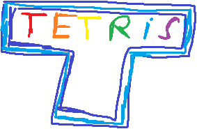

<!-- PROJECT SHIELDS -->
<!--
*** I'm using markdown "reference style" links for readability.
*** Reference links are enclosed in brackets [ ] instead of parentheses ( ).
*** See the bottom of this document for the declaration of the reference variables
*** for contributors-url, forks-url, etc. This is an optional, concise syntax you may use.
*** https://www.markdownguide.org/basic-syntax/#reference-style-links
-->
<!-- [![Contributors][contributors-shield]][contributors-url]
[![Forks][forks-shield]][forks-url]
[![Stargazers][stars-shield]][stars-url]
[![Issues][issues-shield]][issues-url]
[![MIT License][license-shield]][license-url]
[![LinkedIn][linkedin-shield]][linkedin-url] -->

 

  

  <h3 align="center">SFML Tetris</h3>

  

    A somewhat working clone of the classic game Tetris made in C++ using SFML.
     
    <a href="https://github.com/CalcoDev/SFML-Tetris">View Demo</a>
    ·
    <a href="https://github.com/CalcoDev/SFML-Tetris/issues">Report Bug</a>
  

<!-- ABOUT THE PROJECT -->

## About The Project
!!! Some of the code (text rendering function, font and some of the rotation code was taken from [KofyBrek](https://www.youtube.com/c/Kofybrek)) !!!
[![Product Name Screen Shot][product-screenshot]](https://github.com/CalcoDev/SFML-Tetris)

A somewhat working clone of the classic game Tetris made in C++ using SFML. This was made in 2 days, and besides the very badly written and structured code and some small glitches in the game, it's working.

Although it isn't great, tt was a great learning experience, and I'm a much better C++ developer now than before. (Trust me on this, I know the code doesn't reflect it >:( )

### Built With

- [C++](https://en.wikipedia.org/wiki/C%2B%2B)
- [SFML](https://www.sfml-dev.org/index.php)
- [CMake](https://cmake.org/)

## License

Distributed under the MIT License. See `LICENSE.txt` for more information.

<!-- CONTACT -->

## Contact

Calcopod - [@Calcopod](https://twitter.com/Calcopod2)

[product-screenshot]: GithubImages/ProductScreenshot.PNG
